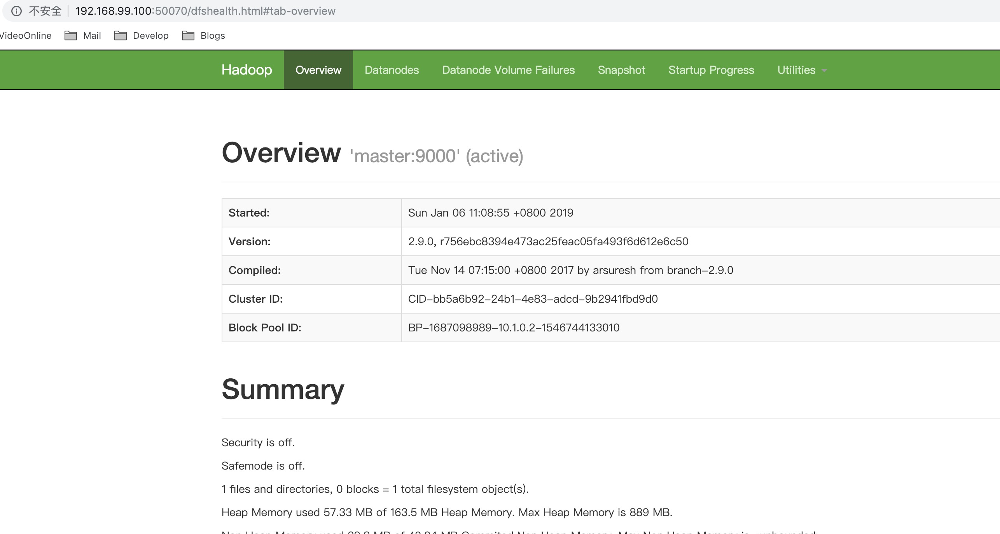

# Hadoop Docker for Test

This docker image is **only for test**! 

You can use it for self unit test while developing.

> Run build instrumentation at project's root path

```
docker build . -t hadoop
```

## Run hadoop cluster local

> Create a docker network for test cluster(if created, ignore it)

```
docker network create cluster --subnet 10.1.1.0/24
```

> Demo: Create 4 docker container (1 master with 3 slaves)

```
docker run -dt \
    --network cluster \
    --name master \
    -e hadoop_master=master \
    -e hadoop_slaves=slave1,slave2,slave3 \
    -p 50070:50070 \
    hadoop

docker run -dt \
    --network cluster \
    --name slave1 \
    -e hadoop_master=master \
    -e hadoop_slaves=slave1,slave2,slave3 \
    hadoop

docker run -dt \
    --network cluster \
    --name slave2 \
    -e hadoop_master=master \
    -e hadoop_slaves=slave1,slave2,slave3 \
    hadoop
    
docker run -dt \
    --network cluster \
    --name slave3 \
    -e hadoop_master=master \
    -e hadoop_slaves=slave1,slave2,slave3 \
    hadoop
```

> Initiate and start hadoop cluster

```
docker exec -it master /bin/bash /opt/bin/initiate-cluster 
```

## Check your cluster status in browser




